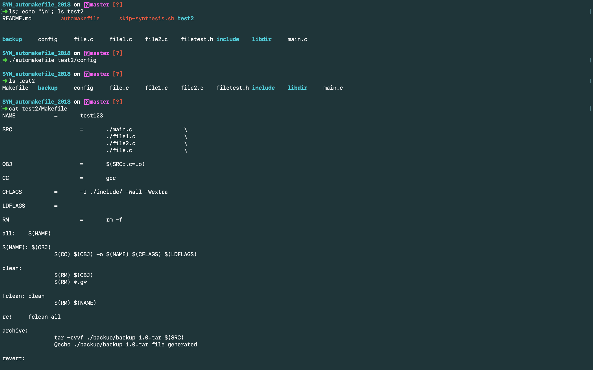

# SYN_automakefile_2018
Réalisation d'un automakefile permettant la création de Makefile via un fichier config

## FONCTIONNEMENT

DESCRIPTION : 
- Création d'un makefile classique
- Fonctionnalités supplémentaires : archivage, désarchivage ...

UTILISATION : 
./automakefile config_file

## FUNCTIONMENT

DESCRIPTION : 
- Basic makefile generation
- Few others function...

USAGE : 
./automakefile config_file

**************

### Quick Preview

